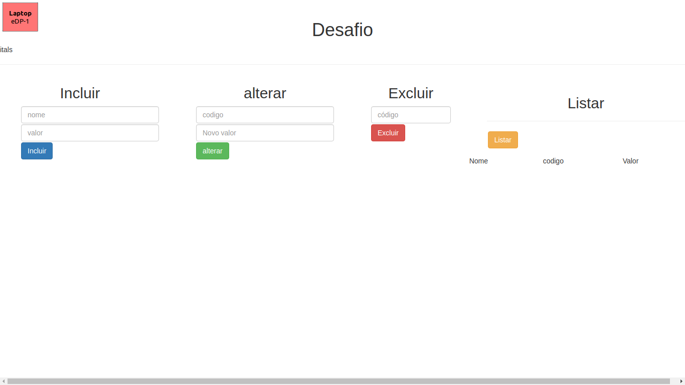

  <h1 align="center" >  
     CRUD</h1> 
  
  
Print Aplicação

 

<h1>🚀 Tecnologias</h1>
 

Esse projeto é um estudo de Front End e Back End usando as seguintes tecnologias:

- ✔️ NodeJs  
-  ✔️ Expresss  
- ✔️ Javascript  
- ✔️ Ajax  
- ✔️ HTML  
- ✔️ CSS  

 

<h1>ℹ️ Como usar</h1>
<h2>É necessario ter o node e npm enstalado na maquina<h2>
<h3>Na pasta back</h3>
<i>npm install</i>  instala as dependencias do package.json   
<i>node index.js</i>  sobe o servidor  

<h3>Na pasta frontEnd</h3>
<i>abra o aquivo index.html em um navegador ou suba com o liveServer extensão do vsCode</i>

